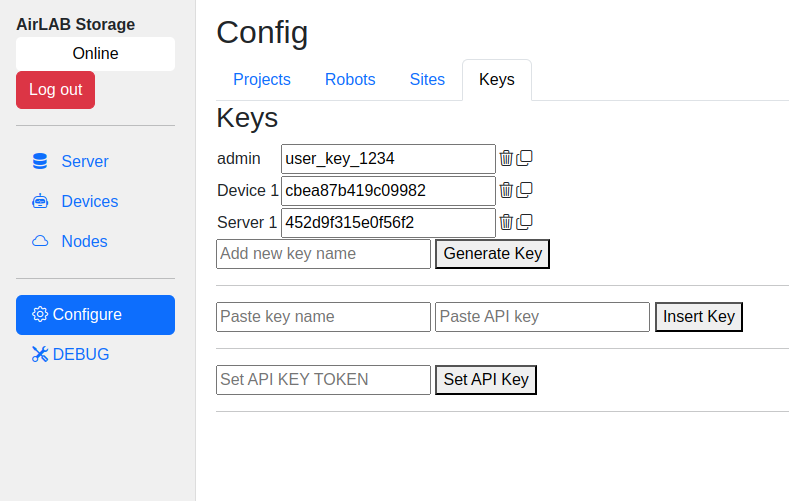

# Adding a New Device

## Create a new API_KEY_TOKEN

* Log into the Server
* Go to Configure -> Keys
    
* Enter a name for the device key in the "Add a new key name" field.
* Click "Generate Key"
* Find the key in the list of keys. Copy the key value.
* Open the device `config.yaml` file. Set the `API_KEY_TOKEN` to the key copied from the Server
* Restart the device.

