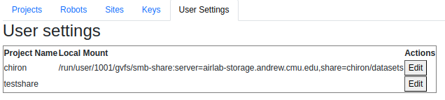

# Configure Settings

## Projects

## Robots

## Sites

## Remote Servers

## Keys

## User Settings

Maps a project name to a locally mounted or stored location.  In this example, the user has used the Linux filebrowser `Nautilus` to mount the `chiron` share from the SMB server.  Any `Foxglove`   links  for `chiron` will use this path prefix.
