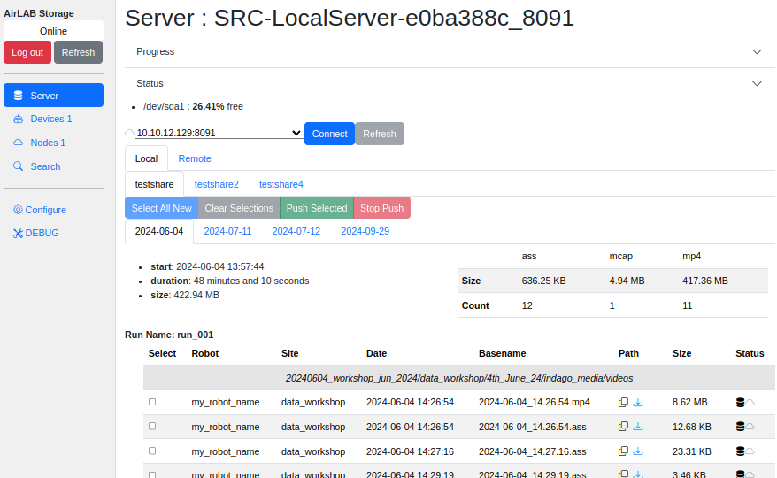

# Understanding The Dashboard

## Online Status

**Online**: The dashboard is connected to the server. You are ready to go.
**Offline**: The dashboard is not connected to the server.  Check that the server is running, or that the internet connection is up.  

[Logout].  Log out of the Admin account. This only works for locally installed servers, not servers running with LDAP.
[Refresh]. Refresh the Server listings. This will show [New Data] when new data has arrived.

## Server Name

The Server Name will always be "SRC-" and a hexadecimal string.  This value is derived from the MAC addresses of all the network adaptors. The name is used to sync with remote server.

### Progress

This section will show status that changes over time, such as progress bars for file copy operations.

### Status

Reports the file system usage on the Server.  

> NOTICE!  
> The Sever does not yet limit uploads to what the server can handle.  

### Connect

If you set up list of `Servers` in the config, they will show up under the Status section.

 and the  button will say "Connect" when Server is disconnected.  Click Connect and the Server will attempt to connect to the remote server.

 and the button will say "Disconnect" when connectd.

Refersh will update the **Remote** Server with the state of your **Local** server.

#### Fails to connect

* Make sure you have a network connection.
* Verify that the `API Key Token` is valid.  Refer to "Adding a Local Server" in [Key Management](KeyManagement.md).

## Pages

* [Server](Server.md)
* [Devices](Devices.md)
* [Nodes](Nodes.md)
