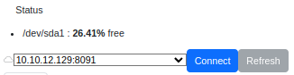
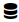

# Understanding The Dashboard

## Online Status

**Online**: The dashboard is connected to the server. You are ready to go.
**Offline**: The dashboard is not connected to the server.  Check that the server is running, or that the internet connection is up.  

[Logout].  Log out of the Admin account. This only works for locally installed servers, not servers running with LDAP.

## Server Name

The Server Name will always be "SRC-" and a hexadecimal string.  This value is derived from the MAC addresses of all the network adaptors. The name is used to sync with remote server.

### Progress

This section will show status that changes over time, such as progress bars for file copy operations.

### Status

Reports the file system usage on the Server.  

> NOTICE!  
> The Sever does not yet limit uploads to what the server can handle.  

### Connect

If you set up list of `Servers` in the config, they will show up under the Status section. 

 and the  button will say "Connect" when Server is disconnected.  Click Connect and the Server will attempt to connect to the remote server.

 and the button will say "Disconnect" when connectd.

Refersh will update the **Remote** Server with the state of your **Local** server.

#### Fails to connect

* Make sure you have a network connection.
* Verify that the `API Key Token` is valid.  Refer to "Adding a Local Server" in [Key Management](KeyManagement.md).

## Server Page

The Server Page will have a top level tab for each uploaded project.  Each project will have a tab for each day that has been uploaded.  

### Remote Actions

Remote Actions are enabled when the Local server is connected to a Remote server.  

* **Select All New**: Select all files on the **Local** server that are not on the **Remote** server.
* **Clear Selections**: Clear all of the selected files.
* **Transfer Selected**: Start copying each of the selected files from **Local** to **Remote**.  The *Progress* section will indicate the status of each ongoing copy, as well as the total status.  Progress bars will update no faster than once per second.
* **Stop Transfer**: Stop any ongoing transfer and dequeue any selected transfers.  Partial transfers are retained on the **Local** server, and will be reused when restarted.  These files have the suffix ".tmp".  

### Server Per Run

The Server attempts to automatically define unique runs.  A run is a set of logs that happen at the same time in the same project.  Runs are defined by `mcap` and `bag` files.  Any support files that have times near these are associcated with the run.  Any files for a day that do not have an assoicated run are given the run name "run__no_name".  

Files on the Dashboard are sorted and grouped by run.  The statistic block above and to the left of a run shows the start date and time, the duration in seconds, and the size of the run in bytes.  The statistic table above and to the right shows a breakdown of the files based on file type. It shows the total size in bytes and total number of each file type.

The Run Table is organized and sorted by the source directory on the Device, relative to `Watch` directory. The directory

### Status Icons

The Server Table provides two status icons for each file.  Hovering the mouse over the icons will provide additional information.  

Local Status

*  The file is in the database and is on the local server.

*  The files is in the database, but was not found.

Remote Status

>Remote Status is only accurate when connected to a remote server.

*  The file is on the remote server.
*  The file is not on the remote server.

### Path Icons

*  Hover to display the full path of the file on the serve. Click to copy this path to the clipboard.  
*  Download the current file to Web Browser machine.