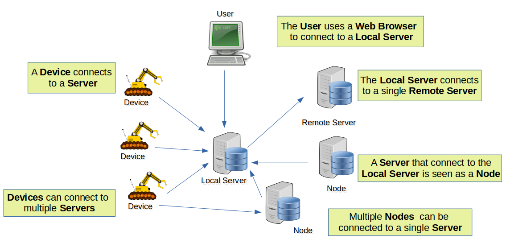
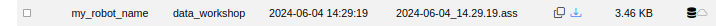
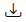
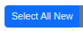
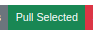
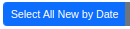
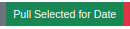
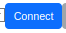
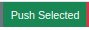

# Overview

## Terminology

* **User**: On a device with a web browser.  Connects to **Local Server**
* **Local Server**: Is connected to by **Users**, **Devices**, and other **Nodes**.
* **Remote Server**: The **Local Server** connects to a **Remote Server**. The **Local Server** is seen as a **Node** to the **Remote Server**.

## Data Flow

* A **User** can download data from a **Server**
* A **Server** can pull data from a **Device**
* The **Local Server** can push data to a **Remote Server**
* The **Local Server** can pull data from a **Remote Server**
* The **Local Server** can pull data from a **Node**

### Download Data from Server

On the **Server** tab, find a file that you want to download.

 Download the current file to Web Browser machine.

### Server Pull from Device

On the **Device** tab, pull data for the whole device, or from a specific day.

#### Pull All Data from Device

 to select all files that are new to the **Local Server**.
 to pull all of the selected files to the **Local Server**.

#### Pull All Data from a Device for a Single Day

 to select all files from the displayed date that are new to the **Local Server**.
 to pull all of the selected for for the displayed date to the **Local Server**.

### Push to a Remote Server

On the **Server** tab, first  to a **Remote Server**. Select the **Local** tab.

All interactions are by **DATE**.  

 to select all files for the selected **date** that are new to the **Remote Server**.

 to push all of the selected files to the **Remote Server**

### Pull from a Remote Server

On the **Server** tab, first  to a **Remote Server**. Select the **Remote** tab.

All interactions are by **DATE**.  

 to select all files for that **date** that are new to the **Local Server**.
 to pull all of the selected files to the **Local Server**.

### Pull Data from a Node

Select the **Nodes** tab.

All interactions are by **DATE**.  

 to select all files for the selected **date** that are new to the **Local Server**.

 to pull all of the selected files to the **Local Server**.
