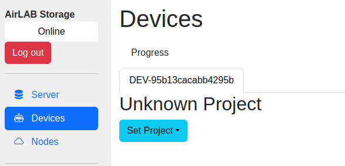
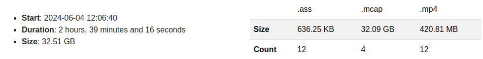

# Devices Page

> Devices will only appear when a device is connected

## Progress

The *Progress* section displays ongoing status on a Device.  This includes searching for new files, processing MD5 sums, and counting messages per topic.

Status of files transfers will be displayed in the *Progress* section.

## Unknown Project

A user can intentionally leave the *Project Name* field blank for a **Device**.  The first time the **Device** connects to a **Server** after a reboot, the **Server** will let the user set the *Project Name*. This setting is not saved in the **Device** config and will be reset when the **Device** is rebooted. This can be changed by navigating to the **Device**'s configuation page.

## Per Device

Each **Device** will have a tab with the **Device** name, and the *Project Name* at the top.

Beneath the *Project Name* is a listing of each *Watch* directory, and the free space.

The summary table shows a breakdown of total size in bytes and count of all files that have alread been copied to the **Server** vs the total and count on the **Device**. These values are also broken down by file type.

This table is updated as files are copied to the **Server** or removed from the **Device**.

## Device Actions

* **Select All New**: Select all of the files that are on the **Device** that have not been copied to the **Server**.
* **Clear Selections**: Clear every selected file, for every day.
* **Transfer Selected**: Start copying every selected file for every day.
* **Stop Transfer**: Stop any ongoing transfer and dequeue any selected transfers.  Partial transfers are retained on the **Server**, and will be reused when restarted.  These files have the suffix ".tmp".
* **Remove Completed**: Request that this **Device** will delete all files that have been successfully transfered to this **Server**.
  > This action can not be reversed.
* **Scan**: Scan this **Device** for new or updated files.
* **Set Project**: Revise the *Project Name* for this **Device**. This setting is not saved in the **Device** config and will be reset when the **Device** is rebooted. This can be changed by navigating to the **Device**'s configuation page.

## Device Per Day

Files are the **Device** are grouped and sorted by day, with one tab per day.

 The statistic block above and to the left of a run shows the start date and time, the duration in seconds, and the size of the run in bytes.  The statistic table above and to the right shows a breakdown of the files based on file type. It shows the total size in bytes and total number of each file type.

## Device Per Date Actions

These actions are only applied to the files for the current *Date* tab.

* **Select All New by Date**: Select all of the files for the current *Date* tab that are on the **Device** that have not been copied to the **Server**.
* **Clear Selections by Date**: Clear every selected file for the current *Date* tab.
* **Transfer Selected for Date**: Start copying every selected file for the current *Date* tab.
* **Remove Completed for Date**: Request that this **Device** will delete all files that have been successfully transfered to this **Server** for the current *Date* tab.
  > This action can not be reversed.
* **Edit Robot**: Change the *Robot Name* for the selected files for the current *Date* tab.
* **Edit Site**: Change the *Site Name* for the selected files for the current *Date* tab

The Day Table is organized and sorted by the source directory on the Device, relative to `Watch` directory. The directory name is displayed centered in a single row.

## Device Per File Actions

* **Robot Name**: Change the *Robot Name* for this file. These changes will be reset after a **Device** reboot.
* **Site Name**: Change the *Site Name* for this file. These changes will be reset after a **Device**reboot.

## Device Per File Status

*  File has not been copied to the **Server**.
*  File has been copied to the **Server**.
