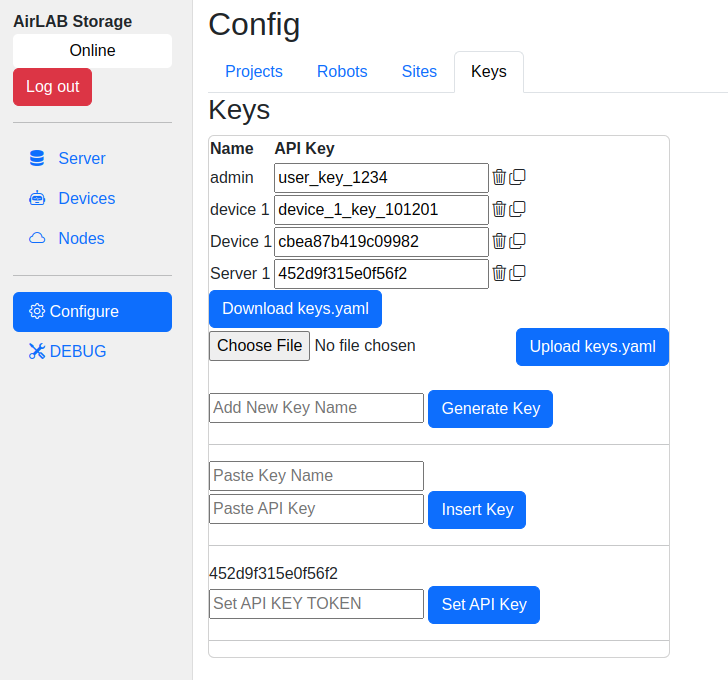

# Key Management

## Adding a New Device

* Log into the Server
* Go to Configure -> Keys
* Enter a name for the device key in the "Add a new key name" field.
* Click "Generate Key". This will add the key to the list of keys (sorted by name) and copy the new key into the clipboard.
* Go to the configuration page for the device, usually http://DEVICE_IP_ADDRESS:8811 unless it was changed.  
* Paste the key into the `API Key Token` field and press [Save].
* The device should attempt to connect to servers.  

## Adding a Local Server

Terms:
The **Local** server is the application that is running on the user's laptop or workstation.

The **Main** server is the application connected to the main data storage.  

* Log into the **Main** server
* Go to Configure -> Keys
* Enter the **Local** server name in the "Add a new key name" field.
* Click "Generate Key"
* Find the key in the list of keys. Copy the API Key value.
* Log into the **Local** server
* Go to Configure -> Keys
* Paste the key in "Set API KEY TOKEN"
* Click "Set API Key"

The **Local** server will now be able to connect to the **Main** server.
