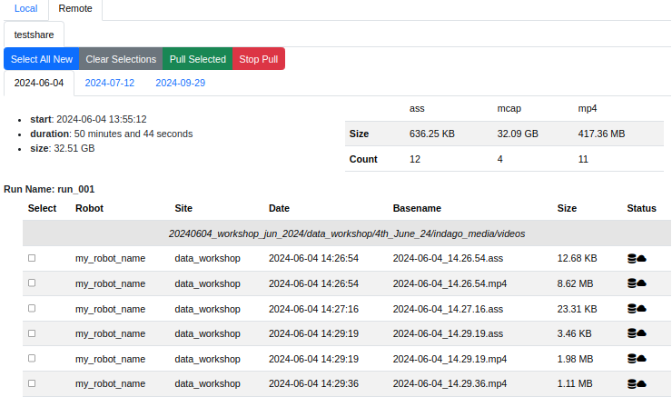

# Server Page

The Server Page *Local* will have a top level tab for each uploaded project.  Each project will have a tab for each day that has been uploaded.  

## Remote Actions

Remote Actions are enabled when the Local server is connected to a Remote server.  

* **Select All New**: Select all files on the **Local** server that are not on the **Remote** server.
* **Clear Selections**: Clear all of the selected files.
* **Push Selected**: Start a file push of the selected files from **Local** to **Remote**.  The *Progress* section will indicate the status of each ongoing copy, as well as the total status.  Progress bars will update no faster than once per second.
  > Notice!
  > There can only be one push operation at a time.  The system does not "queue" up additional operations if you push the button before the transfer is complete.  
* **Stop Push**: Stop any ongoing transfer and dequeue any selected transfers.  Partial transfers are retained on the **Remote** server, and will be reused when restarted.  These files have the suffix ".tmp".  

## Server Per Run

The Server attempts to automatically define unique runs.  A run is a set of logs that happen at the same time in the same project.  Runs are defined by `mcap` and `bag` files.  Any support files that have times near these are associcated with the run.  Any files for a day that do not have an assoicated run are given the run name "run__no_name".  

Files on the Dashboard are sorted and grouped by run.  The statistic block above and to the left of a run shows the start date and time, the duration in seconds, and the size of the run in bytes.  The statistic table above and to the right shows a breakdown of the files based on file type. It shows the total size in bytes and total number of each file type.

The Run Table is organized and sorted by the source directory on the Device, relative to `Watch` directory. The directory name is displayed centered in a single row.

## Status Icons

The Server Table provides two status icons for each file.  Hovering the mouse over the icons will provide additional information.  

Local Status

*  The file is in the database and is on the local server.

*  The files is in the database, but was not found.

Remote Status

>Remote Status is only accurate when connected to a remote server.

*  The file is on the remote server.
*  The file is not on the remote server.

## Path Icons

*  Hover to display the full path of the file on the serve. Click to copy this path to the clipboard.  
*  Download the current file to Web Browser machine.

## Foxglove Icons

*  This file can be run with your locally installed copy of [Foxglove Studio.](https://foxglove.dev/)  Refer to the **User Setttings* in the [Configure](Configure.md) documentation.

Refer to the [Linux Handler](LinuxHandler.md) or the [MacOS Handler](MacOSHandler.md) to configure your system to use these links.

## Remote Files

These are the files that are on the remotely connected server.  These files can be pulled onto the local server.

* **Select All New**: Select all files on the **Remote** server that are not on the **Local** server.
* **Clear Selections**: Clear all of the selected files.
* **Pull Selected**: Start a file pull of the selected files from **Remote** to **Local**.  The *Progress* section will indicate the status of each ongoing copy, as well as the total status.  Progress bars will update no faster than once per second.
  > Notice!
  > There can only be one push operation at a time.  The system does not "queue" up additional operations if you push the button before the transfer is complete.  
* **Stop Pull**: Stop any ongoing transfer and dequeue any selected transfers.  Partial transfers are retained on the **Local** server, and will be reused when restarted.  These files have the suffix ".tmp".  
